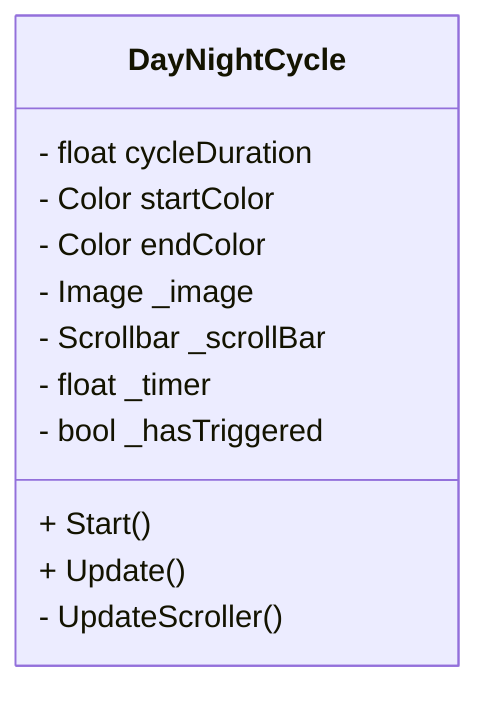
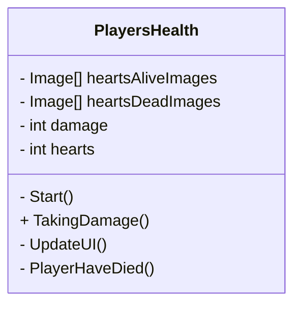

# Coop-Game
Dit is onze repository waar je alles kan vinden over de game Hooked! 

Een medewerker van Linx Interactive gaf voor ons examen de opdracht om een game te maken dat geschikt kan zijn om op netlfix game te staan. 

## Opdracht 
Ontwerp een local co-op game voor 2-4 spelers die geschikt is voor netflix games op TV (Beta) en die Linx Interactive kan pitchen aan Netflix. 

Het GameConcept moet: 
* Gericht zijn op samenwerking tussen spelers, niet op competitie
* Pickup & play zijn en direct te begrijpen
* Compacte gameplay hebben met relatief korte speelsessies
  
## Geproduceerde Game Onderdelen

Merlijn:
* Player Movement
* QR code 

Delysha:
* Hook System

Davey:
* Player Input
* Multiplayer 

Luuk: 
* MainMenu
* WinLooseCondition
* PlayersHeath
* DayNightCycle

Tirza: 
* startscherm
* levelscherm
* UI
* animatie voor de vissen doen

Minoe: 
* startscherm
* levelscherm
* UI

Jaden: 
* design voor characters

Vincent: 
* Bezig met level design
* Haak 

**Day & Night Cycle door Luuk**

De Day & Night Cycle bepaalt de duur van een level. Tijdens het spelen loopt er een timer die een volledige dag voorstelt.
Een visuele balk laat zien hoeveel tijd er nog over is. Deze balk loopt geleidelijk leeg en verandert van kleur van geel naar blauw, zodat de speler duidelijke feedback krijgt over de resterende tijd.
Wanneer de timer is afgelopen, is de dag voltooid en hebben de spelers het level gewonnen.

**Health Systeem**

Het Health Systeem houdt bij hoeveel levens de spelers nog hebben tijdens een level. Wanneer een speler schade oploopt, wordt het aantal levens verminderd.
De resterende levens worden visueel weergegeven in de UI, zodat spelers altijd kunnen zien hoeveel health er nog over is. Op dit moment wordt hiervoor tijdelijke art gebruikt, die later vervangen kan worden door definitieve visuals.

