# Hooked
Dit is onze repository waar je alles kan vinden over de game Hooked! 

Een medewerker van Linx Interactive gaf voor ons examen de opdracht om een game te maken dat geschikt kan zijn om op Netflix game te staan. 

Hooked is een 4-player co-op game waarin spelers vissen besturen die samen vastzitten
in een net en de haken van vissers moeten ontwijken. Doordat alle spelers met elkaar
verbonden zijn, bewegen zij gezamenlijk het net en moeten ze goed samenwerken en
communiceren om te overleven.

De game bevat meerdere levels met verschillende moeilijkheidsgraden. In elk level
moeten spelers een volledige dag overleven, totdat de vissers stoppen en de nacht
begint.

## Core Gameplay Loop
De spelers starten samen vast in een net dat zij gezamenlijk kunnen bewegen. Tijdens
het level verschijnen er verschillende haken die proberen de vissen(Players) te vangen.
De spelers moeten deze ontwijken om te overleven terwijl de tijd doorloopt.

Het doel van de spelers is om de volledige dag te overleven zonder al hun levens te
verliezen. Wanneer de timer afloopt, wordt het level succesvol afgerond en start het
volgende level, dat een hogere moeilijkheidsgraad heeft dan het vorige.

## Opdracht 
Ontwerp een local co-op game voor 2-4 spelers die geschikt is voor netflix games op TV (Beta) en die Linx Interactive kan pitchen aan Netflix. 

Het GameConcept moet: 
* Gericht zijn op samenwerking tussen spelers, niet op competitie
* Pickup & play zijn en direct te begrijpen
* Compacte gameplay hebben met relatief korte speelsessies
  
## Geproduceerde Game Onderdelen

Merlijn:
* Player Movement
* QR code 

Delysha:
* Hook System
* WarningIndecator
* HookDrop
* Spear System
* Bait System

Davey:
* Player Input
* Player Movement
* Multiplayer
* Lobby Systeem 
  
Luuk: 
* MainMenu
* WinLooseCondition
* PlayersHeath
* DayNightCycle
* HookedTouchedEffect
* Snoekbaars

Tirza: 
* startscherm
* levelscherm
* UI
* animatie voor de vissen doen

Minoe: 
* startscherm
* levelscherm
* UI

Jaden: 
* design voor characters

Vincent: 
* Bezig met level design
* Haak 

**Day & Night Cycle door Luuk**

De Day & Night Cycle bepaalt de duur van een level. Tijdens het spelen loopt er een timer die een volledige dag voorstelt.
Een visuele balk laat zien hoeveel tijd er nog over is. Deze balk loopt geleidelijk leeg en verandert van kleur van geel naar blauw, zodat de speler duidelijke feedback krijgt over de resterende tijd.
Wanneer de timer is afgelopen, is de dag voltooid en hebben de spelers het level gewonnen.
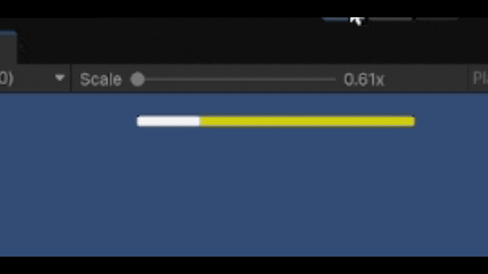
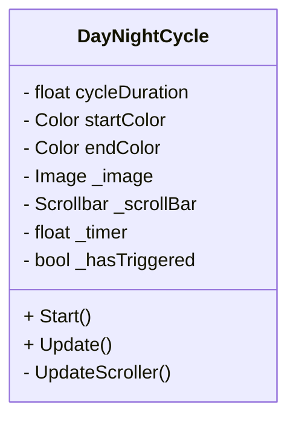
**Health Systeem door Luuk**

Het Health Systeem houdt bij hoeveel levens de spelers nog hebben tijdens een level. Wanneer een speler schade oploopt, wordt het aantal levens verminderd.
De resterende levens worden visueel weergegeven in de UI, zodat spelers altijd kunnen zien hoeveel health er nog over is. Op dit moment wordt hiervoor tijdelijke art gebruikt, die later vervangen kan worden door definitieve visuals.
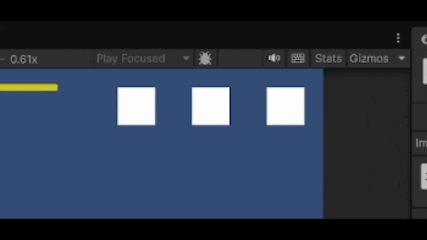
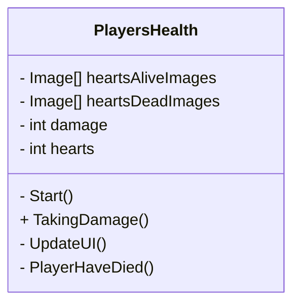
**Win & Lose Condition door Luuk**

De Win & Lose Condition bepaalt of de spelers een level winnen of verliezen.
De spelers verliezen wanneer alle levens op zijn. In dat geval wordt het level opnieuw gestart. De spelers winnen wanneer de Day & Night Cycle is voltooid en de dag succesvol is overleefd.
Dit systeem zorgt voor een duidelijk doel binnen elk level: overleven totdat de tijd op is zonder alle levens te verliezen.
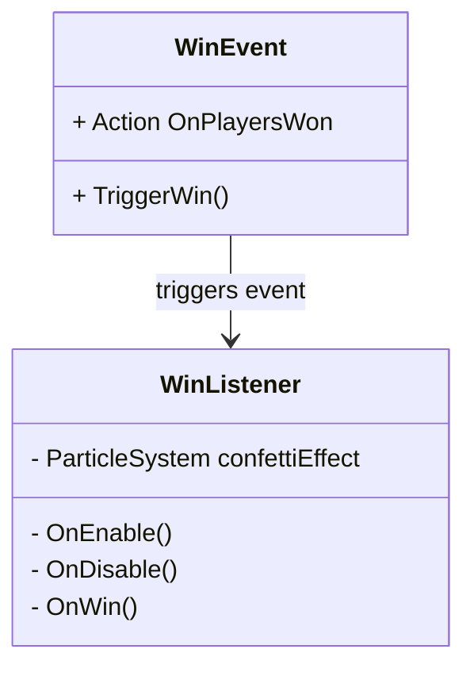

**Player input door Davey en merlijn**

Het Player Input systeem regelt hoe input van spelers vanaf hun telefoon wordt ontvangen, verwerkt en toegepast binnen de Unity game. Dit systeem maakt gebruik van een client-server architectuur waarbij input via een server wordt doorgestuurd naar de game.

Wanneer een speler een actie uitvoert op zijn telefoon (zoals bewegen of een knop indrukken), wordt deze input verstuurd naar de server in de vorm van een JSON-bericht. De server voegt hier een unieke playerId aan toe en stuurt het bericht door naar de Unity applicatie.

Binnen Unity wordt deze input ontvangen door de PhoneInputManager. Omdat netwerkverkeer op een andere thread binnenkomt, wordt de input eerst opgeslagen in een queue. In de Update() loop van Unity wordt deze queue uitgelezen, zodat de input veilig verwerkt kan worden op de main thread.

Na het uitlezen van de input wordt deze doorgestuurd naar de InputRouter. De InputRouter fungeert als een centraal punt dat bepaalt welk systeem de input moet verwerken. Dit is afhankelijk van de huidige staat van de game.

Wanneer de game zich in de lobby bevindt, wordt de input doorgestuurd naar de LobbyInputHandler. In deze situatie wordt de input gebruikt voor het besturen van een cursor en het interacten met UI-elementen, zoals het selecteren van een map of het klaarzetten van spelers.

Wanneer de game zich in de gameplay bevindt, wordt de input doorgestuurd naar de GameplayInputHandler. Deze handler vertaalt de input naar acties van de speler, zoals bewegen. De input wordt hierbij gekoppeld aan de juiste speler op basis van de playerId.

Door gebruik te maken van deze structuur wordt de input losgekoppeld van specifieke gameplay logica. Dit maakt het systeem flexibel en uitbreidbaar, omdat dezelfde input op verschillende manieren geïnterpreteerd kan worden afhankelijk van de context van de game.

**Lobby input door Davey en Luuk**

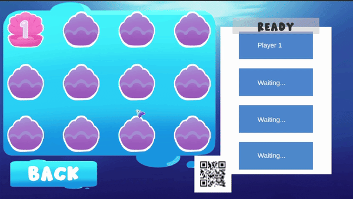

De lobby is de wachtruimte waarin spelers samenkomen voordat de game start. Wanneer spelers verbinding maken met de game via de QR-code, worden zij toegevoegd aan de lobby.

De eerste speler die de lobby betreedt, wordt automatisch aangewezen als host. De host heeft extra functionaliteiten, zoals het bedienen van een cursor om menu-opties te selecteren, bijvoorbeeld het kiezen van een map of het starten van de game.

Elke speler in de lobby heeft een ‘ready’ status. Spelers kunnen zichzelf op ‘ready’ zetten via hun telefoon. Deze status wordt visueel weergegeven in de lobby, zodat alle spelers kunnen zien wie klaar is.

De game kan alleen gestart worden wanneer alle spelers de status ‘ready’ hebben. Indien één of meerdere spelers nog niet klaar zijn, kan de host de game niet starten.

Wanneer een speler de lobby verlaat, wordt deze automatisch verwijderd uit de spelerslijst en wordt de lobby opnieuw geüpdatet.

**Hook Touch Effect door Luuk**

Het Hook Touch Effect zorgt ervoor dat wanneer een speler een haak raakt, er een particle effect wordt afgespeeld en het team een leven verliest. Dit systeem geeft directe visuele feedback bij schade en is gekoppeld aan het health systeem, zodat spelers worden gestraft voor het raken van obstakels.

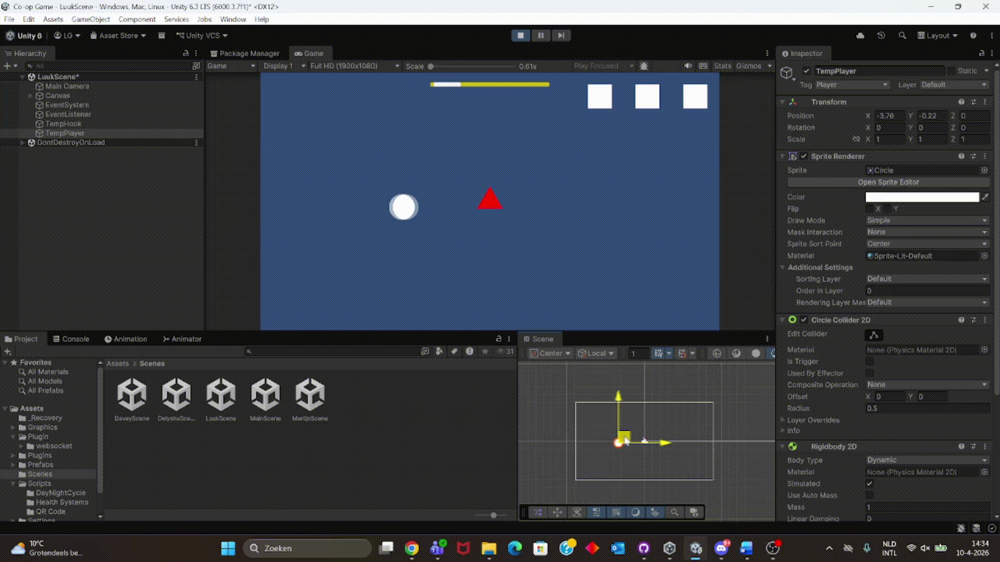

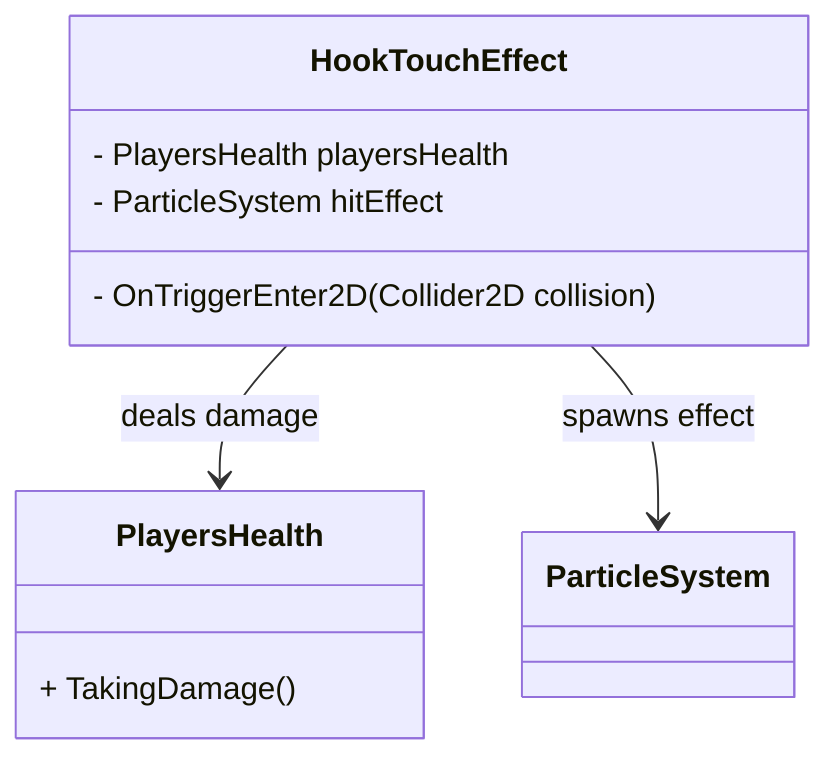

**Snoekbaar door Luuk**

De Snoekbaars komt vanaf de linker- of rechterkant van het scherm en probeert de spelers (vissen) te raken.
Voordat de snoekbaars verschijnt, wordt er een visuele waarschuwing gegeven. Kleine vissen zwemmen snel weg vanaf de kant waar de snoekbaars vandaan zal komen. Hierdoor weten spelers dat er gevaar aankomt en hebben ze kort de tijd om te reageren.
Wanneer de snoekbaars over het scherm beweegt, moeten spelers hem ontwijken. Als een speler geraakt wordt, verliest het team een leven.
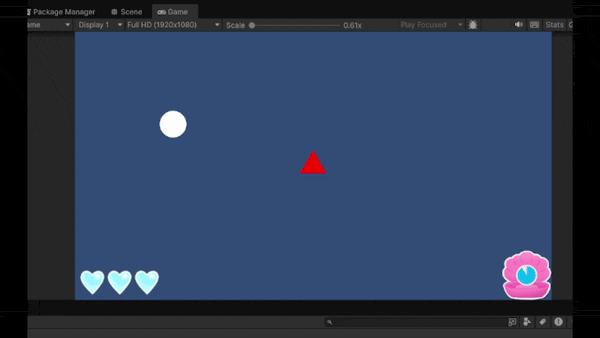

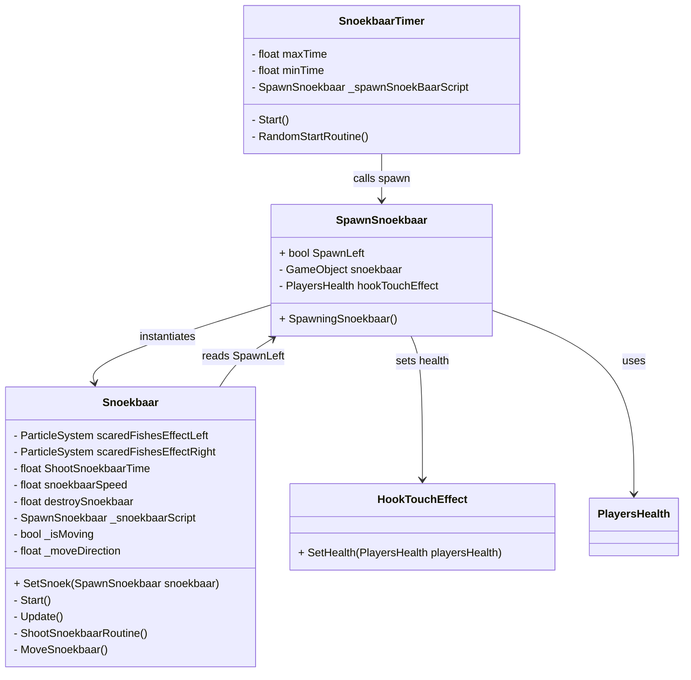

## Bubbel stream door Luuk

De bubbel stream is een nieuw obstakel in de game. In tegenstelling tot andere obstakels veroorzaakt deze geen damage, maar duwt hij de speler omhoog wanneer je erin terechtkomt.
Dit kan ervoor zorgen dat spelers de controle over hun beweging verliezen en uit positie raken.
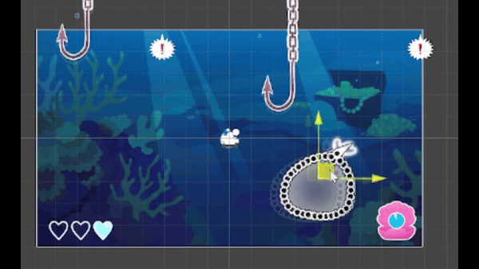

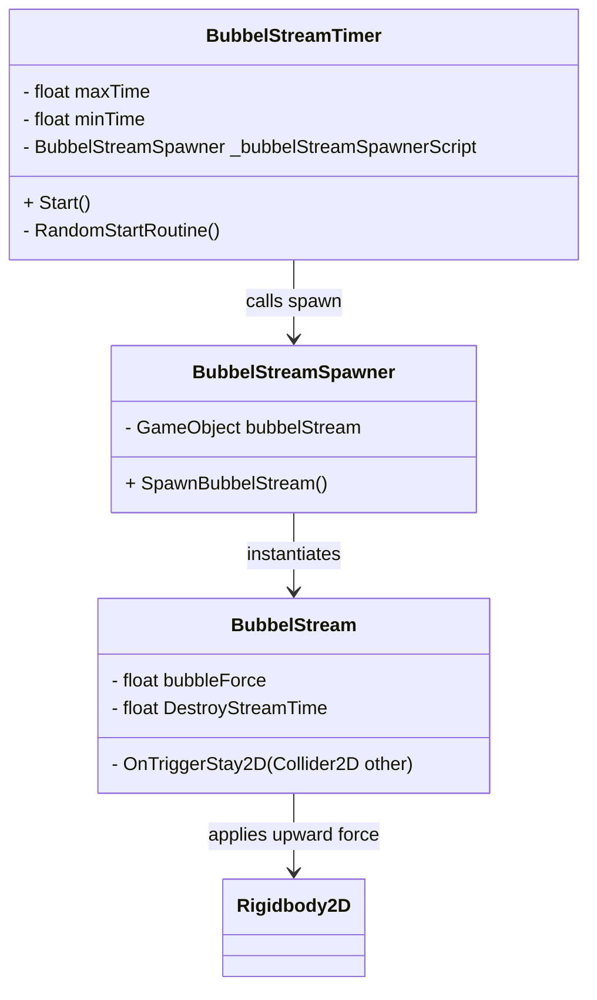

## HookRandomizer door delysha
De hookRandomizer is gemaakt om er voor te zorgen dat de haken in de game naar beneden en boven gaan op random speed capacities. 
daarbij is het ook om er voor te zorgen dat de haken zelf bepalen waar ze naar beneden vallen door te kiezen tussen links en rechts, 
zodat je als speler elke keer de haken op een andere plek moet ontwijken en je niet steeds het zelfde patroon hebt. waardoor het voor de speler heel gaotish lijkt wat de bedoeling is van de game. 

