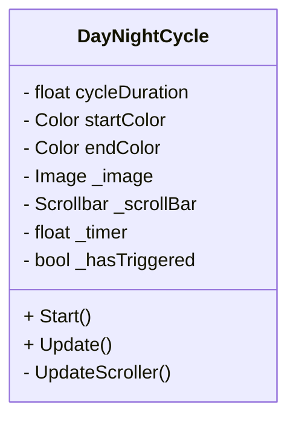
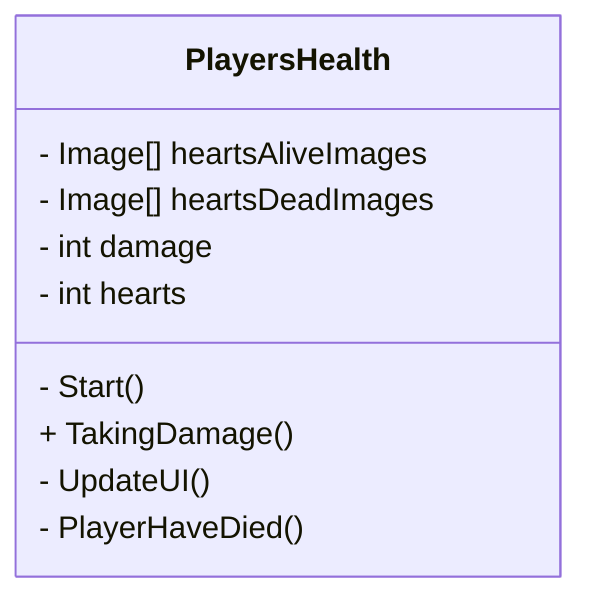
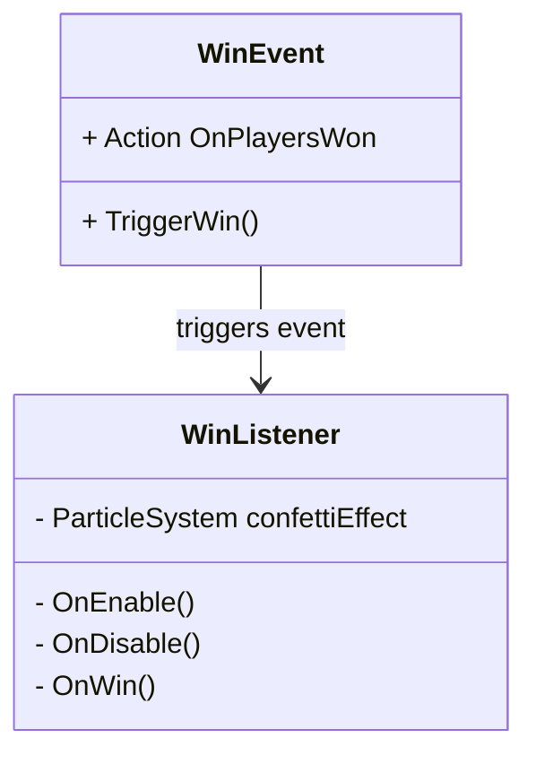

# Hooked
Dit is onze repository waar je alles kan vinden over de game Hooked! 

Een medewerker van Linx Interactive gaf voor ons examen de opdracht om een game te maken dat geschikt kan zijn om op Netflix game te staan. 

Hooked is een 4-player co-op game waarin spelers vissen besturen die samen vastzitten
in een net en de haken van vissers moeten ontwijken. Doordat alle spelers met elkaar
verbonden zijn, bewegen zij gezamenlijk het net en moeten ze goed samenwerken en
communiceren om te overleven.

De game bevat meerdere levels met verschillende moeilijkheidsgraden. In elk level
moeten spelers een volledige dag overleven, totdat de vissers stoppen en de nacht
begint.

## Core Gameplay Loop
De spelers starten samen vast in een net dat zij gezamenlijk kunnen bewegen. Tijdens
het level verschijnen er verschillende haken die proberen de vissen(Players) te vangen.
De spelers moeten deze ontwijken om te overleven terwijl de tijd doorloopt.

Het doel van de spelers is om de volledige dag te overleven zonder al hun levens te
verliezen. Wanneer de timer afloopt, wordt het level succesvol afgerond en start het
volgende level, dat een hogere moeilijkheidsgraad heeft dan het vorige.

## Opdracht 
Ontwerp een local co-op game voor 2-4 spelers die geschikt is voor netflix games op TV (Beta) en die Linx Interactive kan pitchen aan Netflix. 

Het GameConcept moet: 
* Gericht zijn op samenwerking tussen spelers, niet op competitie
* Pickup & play zijn en direct te begrijpen
* Compacte gameplay hebben met relatief korte speelsessies
  
## Geproduceerde Game Onderdelen

Merlijn:
* Player Movement
* QR code 

Delysha:
* Hook System
* WarningIndecator
* HookDrop

Davey:
* Player Input
* Multiplayer 

Luuk: 
* MainMenu
* WinLooseCondition
* PlayersHeath
* DayNightCycle

Tirza: 
* startscherm
* levelscherm
* UI
* animatie voor de vissen doen

Minoe: 
* startscherm
* levelscherm
* UI

Jaden: 
* design voor characters

Vincent: 
* Bezig met level design
* Haak 

**Day & Night Cycle door Luuk**

De Day & Night Cycle bepaalt de duur van een level. Tijdens het spelen loopt er een timer die een volledige dag voorstelt.
Een visuele balk laat zien hoeveel tijd er nog over is. Deze balk loopt geleidelijk leeg en verandert van kleur van geel naar blauw, zodat de speler duidelijke feedback krijgt over de resterende tijd.
Wanneer de timer is afgelopen, is de dag voltooid en hebben de spelers het level gewonnen.

**Health Systeem door Luuk**

Het Health Systeem houdt bij hoeveel levens de spelers nog hebben tijdens een level. Wanneer een speler schade oploopt, wordt het aantal levens verminderd.
De resterende levens worden visueel weergegeven in de UI, zodat spelers altijd kunnen zien hoeveel health er nog over is. Op dit moment wordt hiervoor tijdelijke art gebruikt, die later vervangen kan worden door definitieve visuals.

**Win & Lose Condition door Luuk**

De Win & Lose Condition bepaalt of de spelers een level winnen of verliezen.
De spelers verliezen wanneer alle levens op zijn. In dat geval wordt het level opnieuw gestart. De spelers winnen wanneer de Day & Night Cycle is voltooid en de dag succesvol is overleefd.
Dit systeem zorgt voor een duidelijk doel binnen elk level: overleven totdat de tijd op is zonder alle levens te verliezen.

